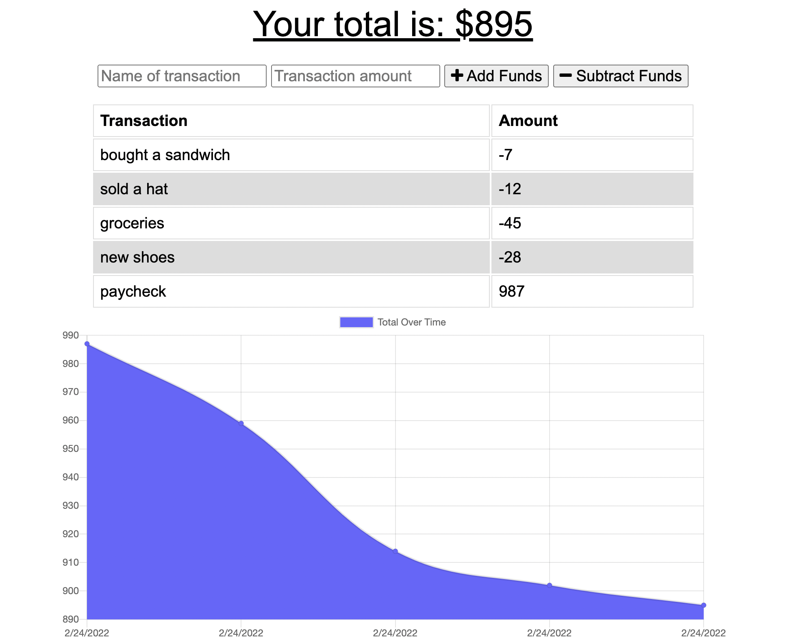

# Budget Tracker
  
  
   
  
                 
   

  ## TABLE OF CONTENTS

  [Description](#description) *
  [Installation](#installation) *
  [Usage](#usage) *
  [Questions](#questions) *
  [License](#license)

   

    
  
   

  ## Description

  This app allows the user to input and graph income and expenses.
   
  Deployment: (https://blooming-plains-15476.herokuapp.com/)
   
  Repo: (https://github.com/sihayah/budget-tracker)

  

  ## Installation

  
  Navigate to https://blooming-plains-15476.herokuapp.com/

   

## Usage

  Use input to add the name and amount of a transaction. Then select the correspondning button to add or remove funds.

   

  ## Questions

  For any further inquiries, please contact me via gitHub: [(sihayah)](https://github.com/sihayah) or email: sihayaharris@gmail.com

   

  

  ## License

  
  [click here for more information about ISC license.]()
  

   
   
