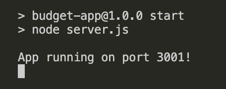
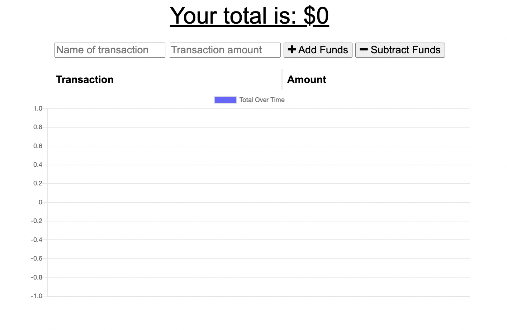

# Budget Tracker
  
  
   
  
                 
   

  ## TABLE OF CONTENTS

  [User Story](#userstory) *
  [Features](#features) *
  [Technologies](#technologies) *
  [Prerequisites](#prerequisites) *
  [Installation](#installation) *
  [Usage](#usage) *
  [Questions](#questions) *
  [License](#license)

   

    
  
   
  Live: https://blooming-plains-15476.herokuapp.com/ 
   
  Repo: https://github.com/sihayah/budget-tracker  
   
   

  ## UserStory

  AS AN avid traveler
  I WANT to be able to track my withdrawals and deposits with or without a data/internet connection
  SO THAT my account balance is accurate when I am traveling 
  
   

  ## Features
  
  This app provides a simple and easy way to track a budget. It allows the user to input and graph income and expenses. Offline functionality allows the user to input data, even without an interent connection.
   
   

  ## Technologies
  
  The following techonologies were used in the production of this application:

  * HTML5
  * CSS3
  * JavaScript
  * Node.js
  * Heroku
  * MongoDB
  * IndexedDB

  ## Prerequisites

  Make sure you have the following installed on your development machine:

  Git - [Download & Install Git](https://git-scm.com/downloads)
   
  Node.js - [Download & Install Node.js](https://nodejs.org/en/download/)
   
  Visual Studio Code - [Download & Install VS Code](https://code.visualstudio.com/download)

   
  
  ## Installation
  To demo this app from a browseer navigate to https://blooming-plains-15476.herokuapp.com/.

   

  To demo locally, clone the repo. Navigate to the root of the repo via command line. Run npm install to install all dependencies via the command line:

    npm install

  And then to start the app run:

    npm start

   

  If it's running the following response should occur in your command line...

    

  If you then navigate to http://localhost:3001, you should see the following:

   

 

  ## Usage

  Use the inputs at the top to add the name and amount of a transaction. Then select the corresponding button to add or remove funds.

   

  ## Questions

  For any further inquiries, please contact me via gitHub: [(sihayah)](https://github.com/sihayah) or email: sihayaharris@gmail.com

   

  

  ## License

  
  [click here for more information about ISC license.](https://opensource.org/licenses/ISC)
  

   
   
